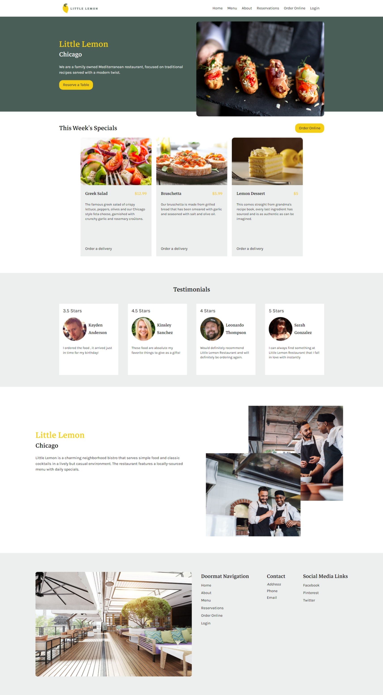
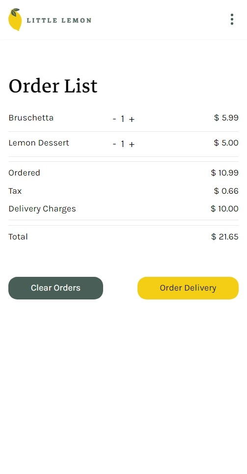
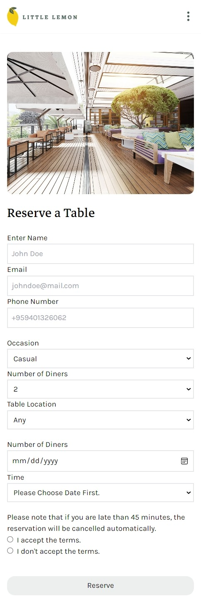

# Little Lemon Resturant

## Fontend REACT Project (Course Assessment for META-FRONTEND DEVELOPER Course)

- Please use `npm install` and `npm run dev`.

- Written with Tailwind CSS.
- Fully Responsive.

### Focus

- Little Lemon Restaurant Landing Page.
  - Section written with semantic HTML5 Tags.
- Little Lemon Restaurant Online Order.
  - Remove or add orders.
- Little Lemon Restaurant Table Reservation Form.
  - Form with real time validation.
  - Disabled submit button until validation complete.

### Landing Page

### Online Order Page

### Table Reservation Page

